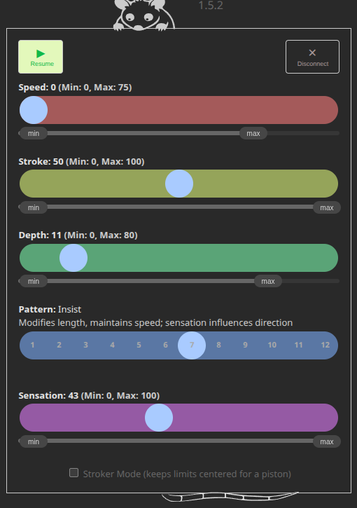

# OSSM Possum 

#### This is a bluetooth remote app for the stock firmware of the [Kinky Makers OSSM](https://www.researchanddesire.com/pages/ossm) that runs as native iOS or Android app, as a web page, or as an offline PWA.

  

## Setup

### There are a few options for using this app:

1. Just pull up this web page in Chrome: [https://rubberyfun.github.io/OSSM-Possum/public/](https://rubberyfun.github.io/OSSM-Possum/public/) 

1. Download it for offline use as a PWA:  Pull up the above webpage, open the browser menu (usually a three dots icon) and choose "Add to Home screen" then "Install".  Poof, its on your phone even if you're in a dungeon with no cell service.

1. Get it from the Google Play store.  Unfortunately Google is being a little bitch about letting the app go live...they require testers first.  **This is a call for help**: please sign up for beta testing to get the android app.  You can do so by joining [this google group](https://groups.google.com/g/ossm-possum).  You'll get an automated message with the download link.  Once 12 people have signed up for testing the app will go live and I'll delete the group permanently.

1. [Get it from the Apple App Store from this link](https://apps.apple.com/us/app/ossm-possum/id6758223317) or by searching for "ossm".  Apple is more straightforward to work with: they just want money. (it's $100/yr to launch apps and you can't do it without having a newer mac).

1. Install the APK directly on your Android device.  You can easily look up how to do this, I won't go into it here.  The APK file is [in the releases](https://github.com/RubberyFun/OSSM-Possum/releases/).

## Demonstration video

<video controls width="100%"> <!-- Sadly this html only works on github pages, not github.com proper -->
  <source src="https://rubberyfun.github.io/OSSM-Possum/public/demo1b.mp4" type="video/mp4" controls>
  Your browser does not support the video tag.
</video>

[Link to the demonstration video](https://rubberyfun.github.io/OSSM-Possum/public/demo1b.mp4)

## Adding custom patterns
R+D doesn't officially support patterns besides the 7 stock ones but they left the option open.  Custom patterns may not be well tested or are known to have potentially dangerous issues (Looking at you Jackhammer an Stroke Nibbler).  **OSSM Possum will happily load whatever patterns you have on your device.**  I am not endorsing using custom patterns, just supporting the possibility. They wouldn't exist if there weren't some fun to be had.  Use caution.

#### Instructions for adding patterns:
1. Add the pattern code to  lib/StrokeEngine/src/pattern.h
1. Add the new names as enUs_StrokeEngineNames variables to src/constants/copy/en-us.h after line 65
1. Add those variables at the end of the same file to the StrokeEngineNames object
1. Increase the size of the StrokeEngineNames at the end of src/structs/LanguageStruct.h
1. Build and upload the modified code to your OSSM device  

**If the above instructions don't make sense to you then you probably shouldn't be doing this yourself!**

## Stroker Mode
I've also developed [OSSM Job: a quick conversion kit to turn your OSSM into a pneumatic stroker](https://rubberyfun.github.io/OSSM-Job) like the Venus 2000, AutoBlow, Tremblr, etc...  To use the OSSM as a stroker it's best to keep the stroke centered within it's range.  To facilitate this I've added a checkbox at the bottom of this app to enable Stroker Mode.  Do no use stroker mode with penetrative toys or physical strokers or you're gonna have a bad time.

## Quirks

- This only supports OSSM devices with a stock firmware from 2026 or newer. If you bought your OSSM before that you can easily upgrade it using their [web flashing tool](https://dashboard.researchanddesire.com/app/tools/web-flasher).

- I didn't include simple penetration mode.  It starts up in the "Simple Stroke" pattern already...They are identical so I just don't see the need.

- If you use a browser and not the app: Safari and Firefox are not onboard with web pages having access to bluetooth...and they never will be for better or worse.  You need Chrome for the web version on Mac or PC...oh and Apple has a stranglehold on iOS chrome, so it won't work for iPhones/iPads at all besides the app.

## Planned features

- Control multiple OSSM's linked from one panel
- Control multiple OSSM's separately from individual tabs
- Automation tab?  Set it to ramp up the speed or stroke over a time span. Maybe have patterns.  
- I'm hesitant to allow input/integration from sources like XToys...I think that's out of scope for the little Possum and gets into [EOM territory](https://github.com/RubberyFun/endless-orgasm-machine).
- [DM me your suggestions at the Kinky Makers discord](https://discord.com/channels/559409652425687041/1286888639501959280/threads/1469058487123443888) and thanks to everyone there for all the testing and suggestions!

## Fine print

I made this for people to enjoy...no strings attached, no cost, no in-app advertising.  [The code is open-source, posted on Github](https://github.com/RubberyFun/OSSM-Possum).

[OSSM Possum](https://github.com/RubberyFun/OSSM-Possum) © 2026 by [Claus Macher](https://rubberyfun.com) is licensed under [CC BY-SA 4.0](https://creativecommons.org/licenses/by-sa/4.0/).  It basically means you can do whatever you want with the code but anything you make with it should include an attribution and keep the same license.  Yes, that means you can make money off your remix but don't just copy the code and call it a day.

This is not directly affiliated with Kinky Makers or their products in any way...I just think they're OSSM.
