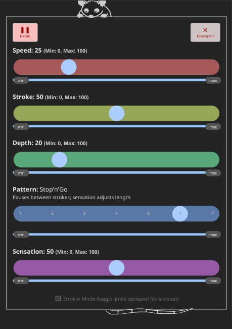

# OSSM Possum

#### This is a bluetooth remote app for the stock firmware of the [Kinky Makers OSSM](https://www.researchanddesire.com/pages/ossm).

## Setup

### There are a few options for using this app:

1. Just pull up the web page in Chrome: [https://rubberyfun.github.io/OSSM-Possum/public/](https://rubberyfun.github.io/OSSM-Possum/public/) ()

1. Download it for offline use as a PWA:  Pull up the above webpage, open the browser menu and choose "Add to Home screen" then "Install".  Poof, its on your phone even if you're in a dungeon with no cell service.

1. Get it from the Google Play store.  This is WIP - estimated launch will be 2/14/2026 due to Google red tape.

1. Get it from the Apple App Store...  Apple is more straightforward to work with: they just want money. (it's $100/yr to launch apps and you can't do it without having a newer mac)

## Demonstration video

<video controls width="100%">
  <source src="public/demo1b.mp4" type="video/mp4" controls>
  Your browser does not support the video tag.
</video>

## Quirks

- This only supports OSSM devices with a stock firmware from 2026 or newer.If you bought your OSSM before that you can easily upgrade it using their [web flashing tool](https://dashboard.researchanddesire.com/app/tools/web-flasher).

- I didn't include simple penetration mode.  It starts up in the "Simple Stroke" pattern already...They are identical so I just don't see the need.

- Safari and Firefox are not onboard with web pages having access to bluetooth...they never will be for better or worse.  You need Chrome for the web version...oh and Apple has a stranglehold on chrome, so it won't work for iOS at all without an app.

## Fine print

I made this for people to enjoy...no strings attached, no cost, no in-app advertising, completely open-source.

This UI was not derived from any previous projects and is released under [Creative Commons Share Alike](https://creativecommons.org/licenses/by-sa/4.0/deed.en) courtesy of Claus Macher.  It basically means you can do whatever you want with the code but anything you make with it should include an attribution and keep the same license.

This is not directly affiliated with Kinky Makers or their products in any way...I just think they're OSSM.